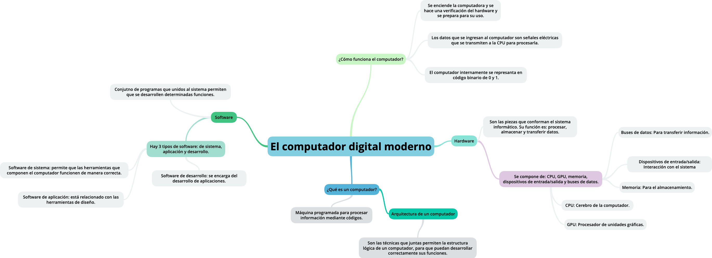

# Actividad 1: El computador digital moderno.

### ``¿Qué es un computador?`` 👩🏾‍💻
Un computador es una maquina programable que sirve para procesar información. 
Cuando se habla de "procesar información"  atendemos a que la información debe estar debidamente codificada para que esta sea comprendida por la máquina; es decir extraer ciertos datos resultados o conclusiones a partir de ciertos datos de entrada.

[Acerca de computador](https://www.uv.es/afuertes/Informatica/ficheros/tema1_TI.pdf)

### ``Arquitectura de un computador``

Son las técnicas que permiten construir las máquinas lógicas generales programables de forma práctica, para que ella sea capaz de ejecutar los algoritmos de forma explicíta.

La arquitectura es todo lo que ve quien lo programa, la *visión funcional*.

**Los tipos de arquitectura**
\
A comienzos de los 80 se tendía a aumentar progresivamente la cantidad de instrucciones disponibles en el hardware y también aumentaba su complejidad.
Para simplificar la adición exagerda de información en el mismo, investigaciones de las universidades de Berkeley y Stanford propusieron: disponer un conjunto mínimo de instrucciones que estuvieran implementadas de forma óptima.
De ahí nacieron los términos RISC y CISC.

*RISC (**R**educed **I**nstruction **S**et **C**omputer)*\
*CISC (**C**omplex **I**nstruction **S**et **C**omputer)*

| RISC | CISC |
|------ | ------ |
|Aquí se emplean instrucciones simples y optimizadas.| |
|Las instrucciones tienen un tamaño fijo y se ejecutan en un solo ciclo.|Usa un conjunto extenso de instrucciones, que se ejecuta en varios ciclos.|
|Se enfoca en la eficiencia y velocidad de ejecución y reduce la necesidad de circuitos en el hardware.|Utiliza un hardware más complejo para decodificar y ejecutar instrucciones.|
|Tiene alta dependencia de la memoria RAM.|Es más eficiente en términos de memoria, ya que una sola puede reemplazar muchas instrucciones RISC.|

[Acerca de la arquitectura del computador.](https://www.fing.edu.uy/tecnoinf/mvd/cursos/arqcomp/material/teo/arq-teo05.pdf)\
[Otra recurso donde puedes encontrar información.](https://triton.astroscu.unam.mx/fruiz/introduccion/introduccion_computacion/Arquitectura%20RISC%20vs%20CISC.pdf)

### ``¿Qué es el hardware?``
El hardware son un conjunto de piezas que conforman un sistema infomático. Es completamente diferente al software, *que está completamente relacionado con los programas y sistemas operativos.* 
El hardware incluye dispositivos como: CPU, memoria, GPU, discos duros y dispositivos de entrada y salida. 
**Su función como tal es: procesar, almacenar y transferir datos dentro de un sistema.** 

### CPU: UNIDAD CENTRAL DE PROCESAMIENTO.
La CPU es el "cerebro" de la computadora, este procesa las instrucciones de los programas y coordinar las tareas del sistema. 
|Partes principales| Función|
|---------|---------|
|**ALU - Unidad Aritmético-lógica.**|Ejecuta operaciones matemáticas y lógicas, como: sumas, restas y operaciones|
|**Unidad de contro.**|Coordina y regula que se ejecuten las instruccioones en el procesador, enviando señales a los otros componentes.|
|**Registros.**|Son cantidades pequeñas de la memoria en la parte interna del procesador que almacena datos temporalmente para procesar isntrucciones de manera rápida.|
|**Buses.**|Son las formas de transporte entre los difentes componentes del sistema, como: memoria, procesado y dispositivos de entrada y salida.|

### GPU: UNIDAD DE PROCESAMIENTO GRÁFICO.
Este procesador es especialmente usado en el manejo de gráficos y cálculos paralelos. Se usa en videojuegos, edición de video y aplicaciones de IA.

### MEMORIA.
La memoria se encarga de almacenar datos y programas en diferentes niveles de velocidad y capacidad de permanencia.

- Registros: Memoria más rápido dentro de la cpu, usada para almacenar datos de procesaiento informado.
- Caché: Es la memoria intermedia entre CPU y RAM. Hace má rápido el acceso a los datos usados con frecuencia.
- Memoria principal (RAM): Allí se almacenan datos temporales mientras la máquina esté encendida, su contenido se pierde al apagarla.
- Memoria secundaria: Esta incluye discos duros y unidades externas, usadas para almacenamiento permantente.

### DISPOSITIVOS DE ENTRADA/SALIDA.
Son los componentes que permiten la interacción con el sistema.
- Entrada: Teclado, mouse, escáner, micrófono, cámara.
- Salida: Monitor, impresora, altavoces.
- Entrada/Saliada: Dispositivos que realizan ambas funciones, como pantallas táctiles, discos duros y memorias USB.

### BUSES DE DATOS.
Corresponden a lineas de comunicación que transfieren información dentro del sistema, hay 3 tipos de buses principales: 
1. Bus de datos: Transporta datos entre la CPU, la memoria y los dispositivos de en trada/salida.
2. Bus de direcciones: Transporta la dirección de memoria donde se encuentran los datos.
3. Bus de control: Envía señales de control y sincronización entre los componentes.

Algunos ejemplos:

Bus SATA **(Serial ATA)**: se usa para conectar discos duros.\
Bus del sistema **(System bus)**: conecta la CPU con la memorial principal y otros dispositivos.\
Bus USB **(Universal Serial Bus)**: Conecta dispositivos externos como teclados, mouse, memorias USB, etc.

[Fuente 1](https://v.isu.edu.mx/pdf/linc/isc/lectura/6.pdf?utm_source=chatgpt.com)\
[Fuente 2](https://www.lifewire.com/cpu-vs-gpu-8693056?utm_source=chatgpt.com)\
[Fuente 3](https://cs.uns.edu.ar/materias/iocp/downloads/Clases%20Teoricas/Clase-01-Conceptos-basicos-Hardware.pdf?utm_source=chatgpt.com)

### ``¿Qué es el software?``

Un software es un conjunto de programas que unidos a un sistema informático permiten que se desarrolle una determinada tarea. Se le pueden atribuir  características como: eficaica, comodidad y rapidez.

[Acerca de Software](https://www.getbillage.com/es/glosario/software)

# *Software de sistema*
Es una pieza indispensable para que el hardware funcione de manera exitosa. Gracias a este las herramientas que componen el ordenador pueden hacer su labor.
Un ejemplo: los sistemas operativos Windows o Mac. Su importancia radica en que establece una relación de conectividad entre el usuario y el computador, facilitando las tareas vinculadas al mismo.

# *Software de aplicación*
Este software tiene diferentes herramientas de diseño desde: bases de cálculo, programas de empresa o de diseño. Este programa permite realizar diversas funciones enfocadas hacia el ámbito recreativo o laboral.

# *Software de desarrollo/programación*
Este es el encargado del desarrollo de aplicaciones por lo que su función es elemental para el desarrollo de la informática y los diferentes programas. 

[Acerca de los tipos de Software](https://www.wolterskluwer.com/es-es/expert-insights/que-tipos-de-software-hay#Software_programacion)

### ``Funcionamiento del computador``

#### *¿Qué procesos se llevan a cabo cuando se enciende una computadora?*

Cuando la computadora se enciende, inicia una secuencia de arranque que prepara el sistema para su funcionamiento.
Sigue una serie de pasos denotada así:
1. Encendido y suministro de energía.
2. Ejecución del POST (Power-On Self-Test): se hacen una serie de pruebas diágnosticas para verificar el correcto funcionamiento del hardware.
3. Carga del gestor de arranque (Bootloader)
4. Inicio del sistema operativo.

#### *¿Qué sucede desde que ingreso un dato a través del teclado, hasta que veo el resultado de la operación en la pantalla?*

El flujo de datos implica varios pasos:
1. Entrada de datos: Cuando se presiona una tecla, se produce una señal eléctrica que el controlador del teclado convierte en un código específico.
2. Transmisión a la CPU: Este código se envía a la CPU a través del bus de datos para que sea procesado.
3. Procesamiento: La CPU interpreta ese código y dependiendo del contexto, puede realizar operaciones adicionales o preparar el dato de salida.
4. Salida de datos: La información que se procesa se envía a la tarjeta gráfica, para convertir señales que enviar al monitor.

#### *¿Cómo se codifican los datos internamente en el computador?*
Las computadoras emplean el sistema binario parta representar y procesar los datos. Esto significa que toda la información se codifica mediante bits (dígitos binarios: 0 y 1).

#### *¿Cuáles son las unidades de medida de datos de un computador?*

|Unidad|Tamaño|
|------|--------|
|Bit: Es la unidad más pequeña de información.||
|Byte|8 bits|
|Kilobyte (KB)|1,024 bytes|
|Megabyte (MB)|1,024 KB|
|Gigabyte (GB)|1,024 MB|
|Terabyte (TB)|1,024 GB|

[Fuente 1](https://www.profesionalreview.com/2023/07/02/proceso-arranque-pc/) \
[Fuete 2](https://www.studocu.com/latam/document/universidad-autonoma-de-santo-domingo/informatica-i/esquema-tarea/105805353) \
[Fuente 3](https://ruben-tese.blogspot.com/2008/07/62-entrada-y-salida-de-datos.html) \
[Fuente 4](https://es.wikipedia.org/wiki/Unidad_de_informaci%C3%B3n)

## Mapa conceptual

