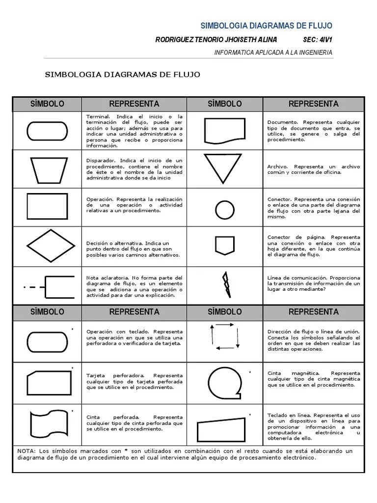

# Algoritmos

## 📤 Ejercicio 1.



## Ejercicio 2


# Actividad 
1. Realice un algoritmo para determinar cuánto se debe pagar por equis cantidad de lápices considerando que si son 1000 o más el costo es de $85 cada uno; de lo contrario, el precio es de $90. Represéntelo con el pseudocódigo y el diagrama de flujo.

**Pseudocódigo:**
```
Inicio 
Leer A
Si A >= 1000
    Costo = 85$
Si no 
    Costo = 90
Fin si
Hacer PrecioTotal = A * Costo
Escribir "El costo total es:", PrecioTotal
Fin
```
**Diagrama de flujo:**


**Python:**
```
cant_lapices = int(input("Ingrese la cantidad de lápices a comprar:"))
if cant_lapices >= 1000:
    total = 85 * cant_lapices
else:
    total = 90 * cant_lapices
print ("El valor a pagar es: $", total)
```

2. Un almacén de ropa tiene una promoción: por compras superiores a $250 000 se les aplicará un descuento de 15%, de caso contrario, sólo se aplicará un 8% de descuento. Realice un algoritmo para determinar el precio final que debe pagar una persona por comprar en dicho almacén y de cuánto es el descuento que obtendrá. Represéntelo mediante el pseudocódigo y el diagrama de flujo.

**Pseudocódigo:**

```
Inicio
Leer  ValorBruto
Si ValorBruto > 250000
    Descuento = ValorBruto * 0.15
Si no 
    Descuento = ValorBruto * 0.08
Fin si
ValorTotalConDescuento = ValorBruto - Descuento
Escribir "El precio final a pagar es", ValorTotalConDescuento
Escribir "El descuento total sobre su compra es:" Descuento
Fin
```

**Diagrama de flujo:**


Python:
(Lo hice de otra manera)

```
ValorBruto = int(input("Ingrese el Valor total de la compra:"))
if ValorBruto > 250000:
    Descuento = 0.15
else:
    Descuento = 0.08
ValorDescuento = ValorBruto * Descuento
ValorTotalConDescuento = ValorBruto - ValorDescuento
print ("El valor bruto de su compra es: $", ValorBruto)
print("El valor de la compra con descuento es:", ValorTotalConDescuento)
```

3. El director de una escuela está organizando un viaje de estudios, y requiere determinar cuánto debe cobrar a cada alumno y cuánto debe pagar a la compañía de viajes por el servicio. La forma de cobrar es la siguiente: si son 100 alumnos o más, el costo por cada alumno es de $65.00; de 50 a 99 alumnos, el costo es de $70.00, de 30 a 49, de $95.00, y si son menos de 30, el costo de la renta del autobús es de $4000.00, sin importar el número de alumnos.

**Pseudocódigo:**
Inicio
Leer numeroAlumnos
Si numeroAlumnos < 30
    total = 4000
    precio = total / numeroAlumnos
Si no
    Si numeroAlumnos < 50
        precio = 95
    Si no
        Si numeroAlumnos < 100
            precio = 70
        Si no
            precio = 65
        Fin si
    Fin si
    total = precio * numeroAlumnos
Fin si
Escribir precio, total

**Diagrama de flujo:**


# Bucles

## Ejercicio 1
Se requiere un algoritmo para obtener la suma de diez cantidades mediante la utilización de un ciclo `while`. Realice el diagrama de flujo y el pseudocódigo.\

**Código en Python**
```py
suma = 0
cont = 1 
while cont <= 10:
    valor = int(input("Ingrese el valor": ))
    suma = suma + valor
    cont = cont + 1
print(f"La suma es:{suma}")
```

## Ejemplo 2
Se requiere un algoritmo para obtener la suma de diez cantidades mediante la utilización de un ciclo `for`. Realice el diagrama de flujo y el pseudocódigo.
**Código en Python**
```py
suma = 0
for cont in range(1,11,1):
    valor = int(input("Ingrese el valor: "))
    suma = suma + valor
print(f"La suma es: {suma}")
```
## Ejericicios del libro.
1. Un profesor tiene un salario inicial de $1500, y recibe un incremento de 10 % anual durante 6 años. ¿Cuál es su salario al cabo de 6
años? ¿Qué salario ha recibido en cada uno de los 6 años? Realice el
algoritmo y represente la solución mediante el diagrama de flujo, el
pseudocódigo y el diagrama N/S, utilizando el ciclo apropiado.

*Análisis*
1. Variables de entrada:

    - No hay.

2. Variables de salida:
    - salario:

3. Constantes:
    - salario_inicial: 1500
    - años: 6
    - incremento: 0.1

4. Otras variables
    - c

5. Ecuaciones
    - $salario = salario + (salario * incremento)$

**Pseudocódigo**
```
Inicio

salario_inicial: 1500
años: 6
incremento: 0.1

Desde c = 0 hasta c = años
    salario = salario_inicial
    Escribir "El salario del año, c, "es de", salario
    salario = salario * incremento
Fin Desde
Fin
```

**Python**
```py
salario_inicial = 1500
incremento = 0.1
años = 6
salario = salario_inicial + (salario_incial * incremento)
for c in range (1,años,1):
    print(f"El salario el año {c} es de {salario}")
    salario = salario + (salario * incremento)
print(f"El salario al cabo de los 6 años es {salario}")
```

2. “El náufrago satisfecho” ofrece hamburguesas sencillas (S), dobles
(D) y triples (T), las cuales tienen un costo de $20, $25 y $28 respectivamente. La empresa acepta tarjetas de crédito con un cargo
de 5 % sobre la compra. Suponiendo que los clientes adquieren N
hamburguesas, las cuales pueden ser de diferente tipo, realice un
algoritmo para determinar cuánto deben pagar. Represéntelo en
diagrama de flujo, pseudocódigo y diagrama N/S. 

*Análisis*
1. Variables de entrada:

    - S.
    - D.
    - T.

2. Variables de salida:
    - precio_total

3. Constantes:
    - hamburguesa_S = 20
    - hamburguesa_D = 25.
    - hamburguesa_T = 28
    - cargo = 0.05

4. Otras variables
    - N = S + D + T

5. Ecuaciones
    - $salario = salario + (salario * incremento)$

**Pseudocódigo**
```
Inicio
hamburguesa_S = 20
hamburguesa_D = 25.
hamburguesa_T = 28
cargo = 0.05
total = 0 
Leer S
c = 0

Mientras c < S
    Leer tipodehamburguesa
    Leer cuantashamburguesas
        Si tipodehamburguesa = S
            total = total = (cuantashamburguesas * hamburguesa_S)
            c = c + cuantashamburguesas
        Si no si tipodehamburguesa = D
            total = total = (cuantashamburguesas * hamburguesa_D)
            c = c + cuantashamburguesas
        Si no si tipodehamburguesa = T
            total = total = (cuantashamburguesas * hamburguesa_T)
            c = c + cuantashamburguesas
        Si no 
            Escribir "Tipo de hamburguesa no válido"
        Fin si
Fin Mientras

Leer pagomediantetarjeta
Si pagomediantetarjeta = 1
    total = total + (total * cargo)
Fin si
Escribir  "El total a pagar es de: $", total
Fin
```
**Python**
```
```
# 📤 Consigna tus respuestas en la bitácora
### Parte 1: Identificar Algoritmos

Responde si los siguientes enunciados representan un algoritmo. Justifica la respuesta:

1. Una página web.
    - No, una página web no es un algoritmo. Puesto que no necesariamente sigue una secuencia de pasos definidos para resolver un problema.
2. Una receta para hacer un pastel, donde se indican ingredientes y pasos a seguir.
    - Sí, si es un algoritmo. Puesto que la receta presenta una serie de pasos claros que deben seguirse para obtener un resultado. 
3. "Piensa en un número y multiplícalo por otro".
    - Sí, puesto que sigue una secuencia de pasos pata realizar una tarea específica.
4. Un manual de instrucciones para armar un mueble, con pasos detallados y un orden claro.
    - Sí, este detalla los pasos ordenados a seguirse para el ensamble del mueble.
5. Una lista de compras organizada en orden alfabético
    - No, porque no describe una serie de pasos solo lista los elementos de forma organizada.

### Parte 2: Variables y Constantes

Indica si las siguientes afirmaciones describen una variable o una constante:

1. El valor de la gravedad en la Tierra, 9.8 m/s².
    - Constante.
2. La edad de una persona calculada en base al año actual y su año de nacimiento.
    - Variable.
3. La cantidad de dinero en una cuenta bancaria.
    - Variable.
4. La velocidad de la luz en el vacío, 299,792,458 m/s.
    - Constante.
5. El radio de un círculo.
    - Variable.

### Parte 3: Características de los Algoritmos

Responde si los siguientes enunciados cumplen con las características de un algoritmo. Justifica la respuesta:

1. Para elegir la ruta más corta entre varias ciudades, el algoritmo examina rutas candidatas, deteniéndose cuando los cambios en la distancia parecen lo suficientemente pequeños.
    - No, este enunciado no cumple con las características de un algoritmo. Puesto que no define pasos y un criterio claro de finalización.
2. Suma los números ingresados y muestra el resultado.
    - Sí, si cumple con las características de los algoritmos. La secuencia de pasos es clara. 
3. Un conjunto de pasos para calcular el área de un rectángulo dado su base y altura.
    - Sí, cumple con las características del algoritmo: recibe base y altura, calcula el área por fórmula y entrega el valor final.
4. El algoritmo cuenta el número de votos obtenidos por cada uno de los candidatos de una elección para presidente. Empieza solicitando el nombre del candidato y finaliza cuando se ingresa el valor -1.
    - Sí, tiene pasos definidos y por ende cumple con las características de un algoritmo.

### Parte 4: Comprensión de Herramientas

Indica si las siguientes afirmaciones son ciertas o falsas respecto al pseudocódigo y diagramas de flujo:

1. El pseudocódigo utiliza símbolos estándar para representar las operaciones lógicas.
    - Falso, no usa símbolos estandar, por el contrario emplea una descripción textual de las operaciones lógicas.
2. Los diagramas de flujo son una representación gráfica de un algoritmo.
    - Verdadero, mediante símbolos gráficos representa los pasos lógicos y el flujo del algoritmo.
3. El pseudocódigo debe estar escrito en un lenguaje de programación específico.
    - Falso, el pseudocódigo no está escrito en  un lenguaje de programación específico. Es una descripción textual que se asemeja a un lenguaje de programación pero informal.
4. Un diagrama de flujo siempre debe tener un inicio y un fin claramente definidos.
    - Verdadero, el diagrama debe tener un punto de inicio y un fin definidos, para representar el flujo del algoritmo completo.

### Parte 5: Estructuras de Control

Describe para qué sirven las estructuras de control. Redacta dos ejemplos, uno de tu vida diaria, es decir cuando tienes que tomar decisiones en tus actividades diarias y oto ejemplo en el que se tengan que utilizar cálculos matemáticos para tomar una u otra decisión.
Las estructuras de control sirven para dirigir el flojo de ejecución de un programa, permitiendo la toma de decisiones, repetir acciones y seleccionar cuales son los caminos diferentes de ejecución.

### *Ejemplo de la vida diaria:*

Si está lloviendo, llevar sombrilla.\
Si no está lloviendo, no llevar sombrillas.

### *Ejemplo con cálculos matemáticos:*

Si el valor de un vestido es menor igual a mi presupuesto, compro el vestido, de lo contrario, no compro el vestido.

## Ejercicio extra (Antes de Retos)
1. Solicitar al usuario 2 números enteros. Imprimir en pantalla los números pares comprendidos entre ellos.

Pseudocódigo
```
Inicio
Leer Numero_1
Leer Numero_2

Si Numero_1 > Numero_2
    nMayor = Numero_1
    nMenor = Numero_2
Si no
    nMayor = Numero_2
    nMenor = Numero_1
Fin si

Mientras nMenor < nMayor  
    Si residuo(nMenor, 2) = 0 //Determinar si nMenor es par.
        Escribir nMenor
    Fin si
    nMenor = nMenor + 1
Fin Mientras
Fin

```

Código en Python
```py
Numero_1 = int(input("Ingrese el primer numero: "))
Numero_2 = int(input("Ingrese el segundo numero: "))

if Numero_1 > Numero_2:
    nMayor = Numero_1
    nMenor = Numero_2
else:
    nMayor = Numero_2
    nMenor = Numero_1
while nMenor <= nMayor:
    if (nMenor % 2) == 0:
        print (nMenor)
    nMenor = nMenor + 1
``` 

2. Serie de Fibonacci\
Pseudocódigo
```
Inicio
Escribir "¿Cuántos números de la serie desea imprimir?"
Leer cantidad

// Términos de la serie
n1 = 0
n2 = 1
Escribir n1, n2
cantidad = cantidad - 2
Mientras cantidad > 0
    Resultado = n1 + n2
    Escribir Resultado
    n1 = n2
    n2 = Resultado
    cantidad = cantidad - 1
Fin Mientras
Fin
```
