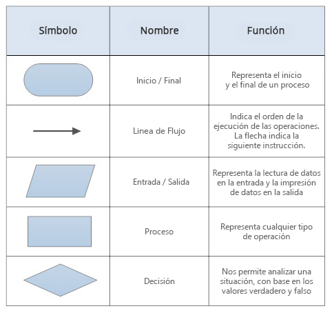

# Algoritmos

## 📤 Ejercicio 1.



## Ejercicio 2


# Actividad 
1. Realice un algoritmo para determinar cuánto se debe pagar por equis cantidad de lápices considerando que si son 1000 o más el costo es de $85 cada uno; de lo contrario, el precio es de $90. Represéntelo con el pseudocódigo y el diagrama de flujo.

**Pseudocódigo:**
```
Inicio 
Leer A
Si A >= 1000
    Costo = 85$
Si no 
    Costo = 90
Fin si
Hacer PrecioTotal = A * Costo
Escribir "El costo total es:", PrecioTotal
Fin
```
**Diagrama de flujo:**


**Python:**
```
cant_lapices = int(input("Ingrese la cantidad de lápices a comprar:"))
if cant_lapices >= 1000:
    total = 85 * cant_lapices
else:
    total = 90 * cant_lapices
print ("El valor a pagar es: $", total)
```

2. Un almacén de ropa tiene una promoción: por compras superiores a $250 000 se les aplicará un descuento de 15%, de caso contrario, sólo se aplicará un 8% de descuento. Realice un algoritmo para determinar el precio final que debe pagar una persona por comprar en dicho almacén y de cuánto es el descuento que obtendrá. Represéntelo mediante el pseudocódigo y el diagrama de flujo.

**Pseudocódigo:**

```
Inicio
Leer  ValorBruto
Si ValorBruto > 250000
    Descuento = ValorBruto * 0.15
Si no 
    Descuento = ValorBruto * 0.08
Fin si
ValorTotalConDescuento = ValorBruto - Descuento
Escribir "El precio final a pagar es", ValorTotalConDescuento
Escribir "El descuento total sobre su compra es:" Descuento
Fin
```

**Diagrama de flujo:**


Python:
(Lo hice de otra manera)

```
ValorBruto = int(input("Ingrese el Valor total de la compra:"))
if ValorBruto > 250000:
    Descuento = 0.15
else:
    Descuento = 0.08
ValorDescuento = ValorBruto * Descuento
ValorTotalConDescuento = ValorBruto - ValorDescuento
print ("El valor bruto de su compra es: $", ValorBruto)
print("El valor de la compra con descuento es:", ValorTotalConDescuento)
```

3. El director de una escuela está organizando un viaje de estudios, y requiere determinar cuánto debe cobrar a cada alumno y cuánto debe pagar a la compañía de viajes por el servicio. La forma de cobrar es la siguiente: si son 100 alumnos o más, el costo por cada alumno es de $65.00; de 50 a 99 alumnos, el costo es de $70.00, de 30 a 49, de $95.00, y si son menos de 30, el costo de la renta del autobús es de $4000.00, sin importar el número de alumnos.

**Pseudocódigo:**
Inicio
Si alumnos 
**Diagrama de flujo:**
