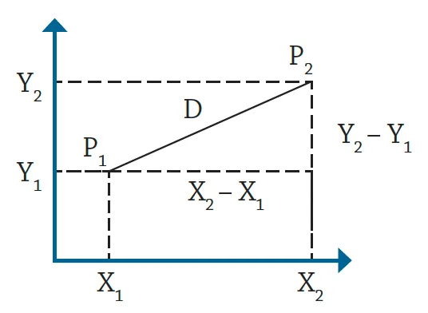
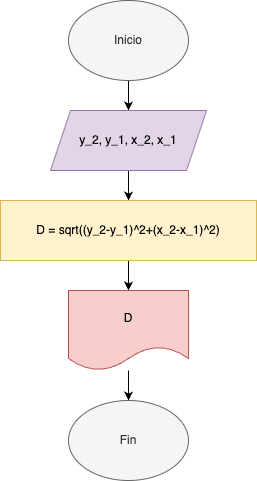
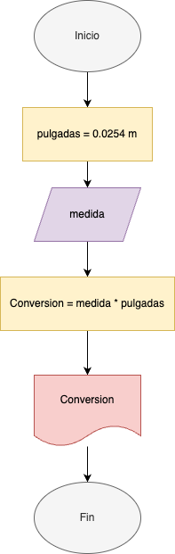
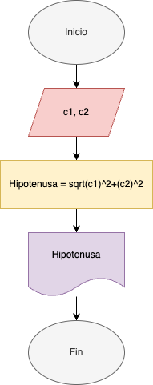
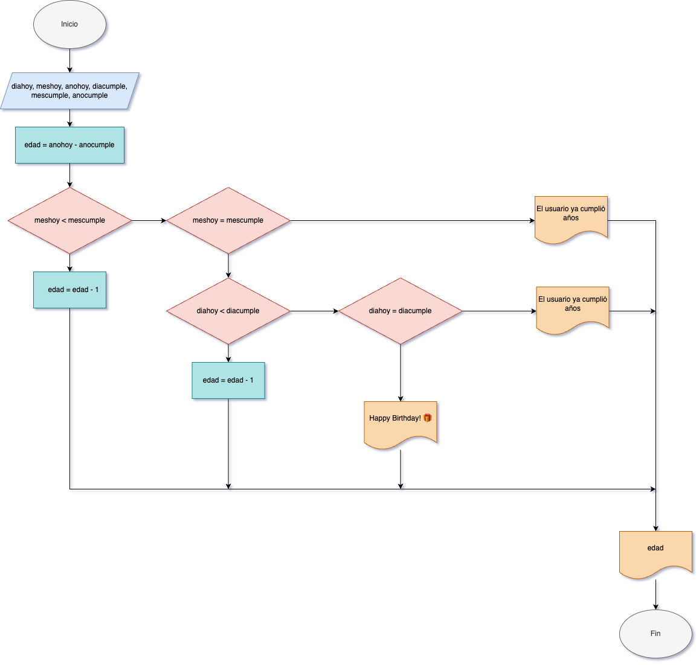

# Retos y problemas

1. Se requiere obtener la distancia entre dos puntos en el plano cartesiano,
tal y como se muestra en la figura 1. Realice un diagrama de flujo y pseudocódigo que representen el algoritmo para obtener la distancia entre
esos puntos.



Solución:

#### Pseudocódigo
```
Inicio

Escribir "Para hallar la distancia entre puntos, ingrese las coordenadas de ambos puntos"

Leer y_2
Leer y_1
Leer x_2
Leer x_1

D = sqrt((y_2-y_1)^2+(x_2-x_1)^2)
Imprimir D
Fin
```

#### Diagrama de flujo



2. Una modista, para realizar sus prendas de vestir, encarga las telas al extranjero.
Para cada pedido, tiene que proporcionar las medidas de la tela
en pulgadas, pero ella generalmente las tiene en metros. Realice un algoritmo
para ayudar a resolver el problema, determinando cuántas pulgadas
debe pedir con base en los metros que requiere. Represéntelo mediante un
diagrama de flujo y pseudocódigo (1 pulgada = 0.0254 m).

#### Pseudocódigo
```
Inicio
Escribir "Ingrese las medidas a convertir de metros a pulgas"
Leer medida
pulgadas = 0.0254 m

Conversion = medida * pulgadas
Imprimir conversion
Fin
```

#### Diagrama de flujo



3. Se requiere determinar la hipotenusa de un triángulo rectángulo. ¿Cómo sería el diagrama de flujo y el pseudocódigo que representen el algoritmo para obtenerla? 
Recuerde que por Pitágoras se tiene que: $C^2 = A^2 + B^2$.

#### Pseudocódigo
```
Inicio 
Escribir "Ingrese el valor de los catetos del triángulo"
Leer c1
Leer c2

Hipotenusa = sqrt(c1)^2+(c2)^2
Imprmir Hipotenusa
Fin
```

#### Diagrama de flujo


4. Se requiere determinar la edad actual de una persona basándose en su fecha de nacimiento. Además, es necesario establecer si la persona ya ha cumplido años en el año en curso, si aún no lo ha hecho, o si hoy es su cumpleaños, para celebrarlo. La fecha de nacimiento y la fecha actual estarán representadas mediante tres variables: día, mes y año.

```
Inicio
Leer diahoy
Leer meshoy
Leer anohoy
Leer diacumple
Leer mescumple
Leer anocumple

edad = anohoy - anocumple
Si meshoy < mescumple
    edad = edad - 1
Si no si meshoy = mescumple
    Si diahoy < diacumple
        edad = edad - 1
    Si no si diahoy = diacumple
        Imprimir "Happy Birthday! 🎁"
    Si no 
        Imprmir "El usuario ya cumplió años"
    Fin si
Si no 
    Escribir "El usuario ya cumplió años"
Fin si
Imprimir edad
Fin
```

#### Diagrama de flujo


5. Realice un algoritmo que permita determinar el sueldo semanal de un trabajador con base en las horas trabajadas y el pago por hora, considerando que a partir de la hora número 41 y hasta la 45, cada hora se le paga el doble, de la hora 46 a la 50, el triple, y que trabajar
más de 50 horas no está permitido. Represente el algoritmo mediante pseudocódigo.